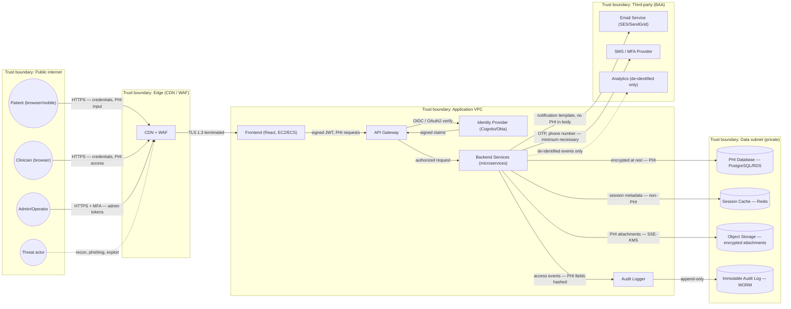

# Data Flow Diagram — DCS Care Connect Health 360

This DFD models the real data flows for a healthcare web application handling PHI. It identifies trust boundaries (zones), data stores, external entities, and the data classes that cross each boundary.

## Legend

- **Trust boundary**: dashed `subgraph` (data crossing a boundary changes risk profile)
- **External entity**: oval / stadium shape (`(( ))`)
- **Process**: rectangle (`[ ]`)
- **Data store**: cylinder (`[(  )]`)
- **PHI / PII / Secret**: annotated on the flow

## Level-0 (context) diagram

## Data classification crossing each boundary

| Flow | Classification | Encryption in transit | Encryption at rest | Sensitive fields |
|------|----------------|------------------------|--------------------|------------------|
| Patient → CDN | PHI + Credentials | TLS 1.3 | n/a | SSN, DOB, conditions, password |
| CDN → FE | PHI | TLS 1.3 (mTLS internal) | n/a | Same as above |
| Backend → AppDB | PHI | TLS (in-VPC) | AES-256 (KMS) | All clinical records |
| Backend → ObjectStore | PHI (attachments) | TLS | SSE-KMS (CMK) | Lab PDFs, images |
| Backend → Audit → AuditStore | PII identifiers (hashed) | TLS | AES-256, WORM | userId hash, action, timestamp |
| Backend → Email | No PHI in body, opaque links only | TLS | n/a | email address |
| Backend → SMS | Phone number + OTP | TLS | n/a | phone, 6-digit code |
| Backend → BAAAnalytics | De-identified (HIPAA Safe Harbor §164.514(b)(2)) | TLS | per vendor | no direct identifiers |

## Trust boundary checklist

For each boundary, controls REQUIRED before data crosses:

- **Public → Edge**: WAF rules (OWASP CRS), rate limiting, geo-blocking for restricted regions, bot detection.
- **Edge → App VPC**: mTLS, source IP allowlist for edge, request signing.
- **App VPC → Data subnet**: security group restricts to backend service identities (IAM roles, not IPs), DB credentials from secrets manager (rotated ≤ 90d), no admin access from internet.
- **App VPC → Third-party**: signed BAA on file, vendor SOC 2 Type II, only minimum necessary data (HIPAA §164.502(b)).

## Out-of-band flows (not shown in diagram, but in scope)

- **Backup pipeline**: AppDB → encrypted snapshot → cross-region S3 (PHI; encryption with separate KMS key).
- **Break-glass admin access**: Bastion + session recording; flagged in audit.
- **Developer access to non-prod**: synthetic data only — production PHI never leaves prod VPC (enforced by data-loss-prevention policy).
