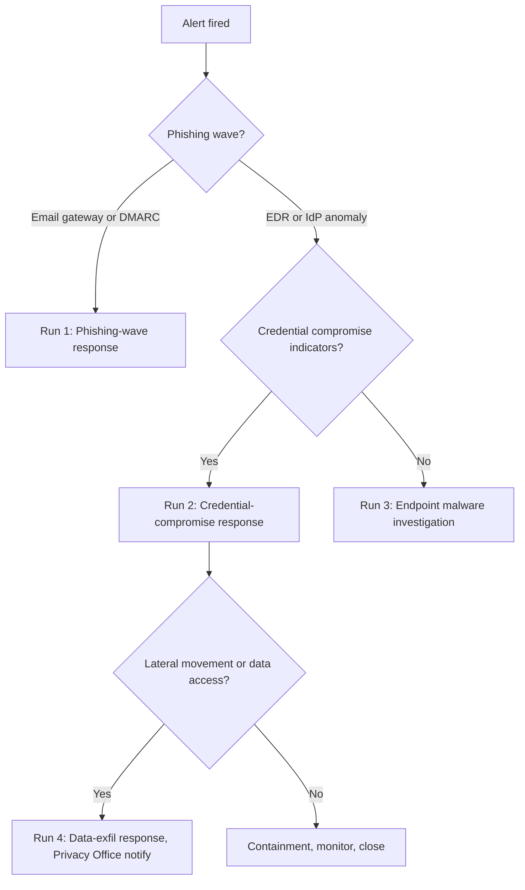

# Blue-Team Runbook — Scenario 1: AI-generated phishing → admin credential compromise

## Scope

Detection, triage and response for the kill-chain documented in `README.md` (Recon → Weaponization → Delivery → Exploitation → Installation → C2 → Actions). This runbook is what on-call follows; the threat-model README is the static analysis.

## SLO targets

| Phase | Metric | Target |
|-------|--------|--------|
| Delivery | Mean Time to Detect (MTTD) phishing wave | < 30 min from first delivered mail |
| Exploitation | MTTD compromised credential use | < 1 h from first anomalous login |
| Containment | Mean Time to Contain (MTTC) — revoke session, rotate cred | < 1 h from confirmed compromise |
| Recovery | MTTR — restore service, complete forensic snapshot | < 24 h |

## Detection sources

| Phase | Source | Signal |
|-------|--------|--------|
| Recon | OSINT monitoring | New impersonating domain registered (`dcs-careconnect[.-]*`) — typosquatting detected |
| Delivery | Email gateway (Proofpoint / Mimecast / IronPort) | Inbound mail with high phishing-score, AI-generated indicators (perplexity / classifier), spoofed display name |
| Delivery | DMARC reports | Reject events on `@dcs.com` to external recipients (someone is spoofing us) |
| Exploitation | EDR | Process tree `outlook.exe → mshta.exe / powershell.exe -enc` |
| Exploitation | IdP (Okta / Cognito) | Successful authentication from anomalous ASN, impossible-travel, new device, new user-agent |
| Installation | CloudTrail / audit log | New IAM user / access key created outside change window; new admin-role grant |
| C2 | Egress firewall, DNS | Outbound to newly registered domain, low-reputation IP, beaconing pattern |
| Actions | DB audit, S3 access log | Bulk read of patient records by a single principal; large `GetObject` from PHI bucket |

## Sigma detection rules (canonical references)

| Technique | Sigma rule (suggested) |
|-----------|------------------------|
| T1566.001 Spear-phishing Attachment | `proc_creation_win_office_spawn_unusual_process` |
| T1190 Exploit Public-Facing App | `web_unusual_user_agent`, `waf_block_then_success` |
| T1078 Valid Accounts | `okta_impossible_travel`, `aws_console_login_from_new_geo` |
| T1136 Create Account | `aws_iam_user_creation`, `okta_new_admin_grant` |
| T1102 Web Service C2 | `dns_new_domain_first_seen`, `proxy_beacon_periodicity` |
| T1565.001 Stored Data Manipulation | `db_anomalous_update_volume_per_user` |
| T1486 Data Encrypted for Impact (if escalates) | `s3_mass_object_overwrite`, `kms_unusual_decrypt_volume` |

(Replace with the team's actual rule IDs in the SIEM.)

## Triage decision tree

## Run #1 — Phishing wave response

1. **Contain delivery**: from the email gateway, block sender, sender domain, URL, attachment hash.
2. **Recall**: pull delivered mails from any inbox that received them.
3. **Notify**: send all-staff awareness mail with the specific lure (subject line, sender) — do not reveal investigation details.
4. **Hunt**: search EDR for any endpoint that opened the attachment / clicked the link in the last 7 days.
5. **Authoritative DNS / WHOIS**: report the malicious domain to the registrar; submit to phishing feeds (APWG, PhishTank).
6. **Document**: ticket in `SEC-DCS` with sender, lure, recipients, hashes, IPs.

## Run #2 — Credential compromise response

Within 1 hour of confirmation:

1. **Revoke** active sessions for the principal (IdP "kill all sessions" + cookie-jwt blocklist on API gateway).
2. **Rotate**: password (force on next login) + all access keys / API tokens of the principal + any service account they touched.
3. **Disable** the account temporarily; re-enable only after identity-verified re-issue.
4. **Audit**: pull last 30 days of activity for the principal — every login, every CloudTrail event, every PHI record read.
5. **Notify**: incident commander, principal's manager (HR loop if insider), Legal if PHI touched.
6. **Preserve**: snapshot endpoint memory + disk; export IdP and CloudTrail logs for the principal to evidence vault.

## Run #3 — Endpoint malware investigation

1. **Isolate** host from network via EDR.
2. **Collect** memory image, prefetch, scheduled tasks, autoruns, persistence keys.
3. **Hash & submit** suspicious binaries to internal sandbox + threat-intel.
4. **Hunt** the same IOC across fleet.
5. **Re-image** the host; do NOT just clean — APTs nest.

## Run #4 — Data-exfil response (PHI involved)

This branch invokes the HIPAA Breach Notification flow.

1. **Quantify**: count records, columns, patients affected. Use audit log; do NOT query prod DB ad-hoc.
2. **Risk assessment** per 45 CFR §164.402(2) — four-factor evaluation; document in evidence vault.
3. **Notify** Legal + Privacy Office within 24 h of confirmation.
4. **Customer notice**: drafted by Legal + Comms; reviewed by CISO; dispatched within 60 days but target ≤ 10 days.
5. **HHS Secretary notice**: immediate if > 500 individuals; annual roll-up otherwise.
6. **Post-incident review**: blameless, within 5 business days; output goes into the threat-model update.

## Evidence preservation checklist

Capture into the evidence vault, retained 6 years (HIPAA §164.316(b)(2)):

- [ ] Email original headers + body + attachments (RFC 5322 source)
- [ ] EDR timeline export (JSON)
- [ ] IdP login events for the principal (90-day window)
- [ ] CloudTrail / activity log for the principal + any service account
- [ ] DB audit rows: every record read by the principal in window
- [ ] S3 server-access logs / object-level CloudTrail
- [ ] Network flow logs (VPC flow / Zeek) for endpoint and C2 IPs
- [ ] Memory image + disk image of any compromised host
- [ ] Hashes of any malware sample with provenance

## Communication tree

| Role | When notified | Channel |
|------|---------------|---------|
| Incident commander (on-call security) | T+0 | PagerDuty |
| Engineering manager of affected service | T+15m | Slack + page |
| CISO | T+1h if confirmed compromise | Phone |
| Legal + Privacy Office | T+1h if PHI implicated | Phone + email |
| Communications | T+4h if customer notice likely | Email |
| HHS / external | per HIPAA Breach Notification timeline | Formal |

## Tabletop refresh

Run this runbook against a simulated incident **quarterly**. Update detection rules, IOCs, and SLOs based on findings. Track results in `evidence-vault/tabletop/YYYY-Q*/`.
