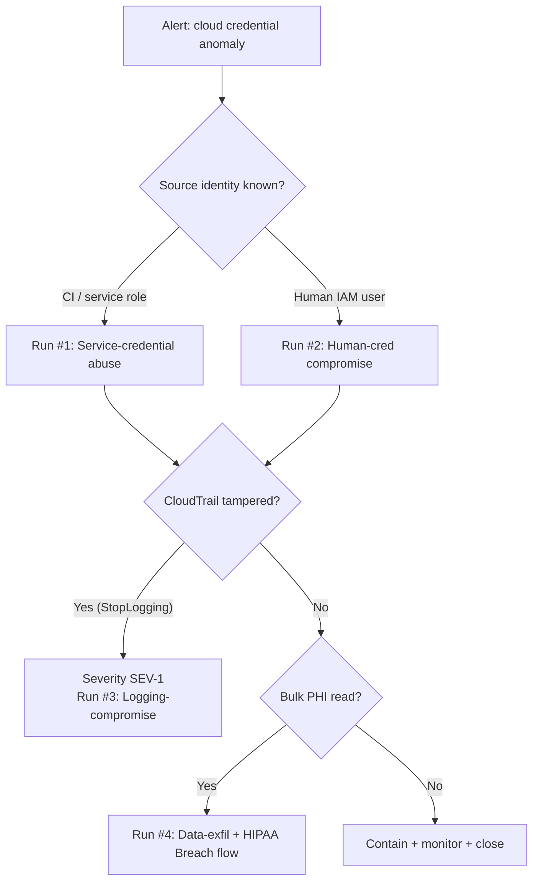

# Blue-Team Runbook — Scenario 2: Cloud credential abuse → data-lake exfiltration

## SLO targets

| Phase | Metric | Target |
|-------|--------|--------|
| Credential leak (push to public repo) | MTTD | < 5 min (secret-scanning push protection) |
| In-tenant credential abuse | MTTD | < 15 min (GuardDuty + CT anomaly) |
| `StopLogging` event | MTTD | < 5 min (CloudTrail metric filter + alarm) |
| Containment (revoke, rotate, isolate) | MTTC | < 30 min |
| Forensic snapshot + scope | MTTR | < 24 h |

## Detection sources

| Phase | Source | Signal |
|-------|--------|--------|
| Leak | GitHub Advanced Security secret scanning | Push protection block / alert |
| Leak (after-the-fact) | TruffleHog / Gitleaks scan | Finding in public commit |
| Initial Access | GuardDuty | `UnauthorizedAccess:IAMUser/*`, `Discovery:S3/*`, `Exfiltration:S3/*` |
| Initial Access | CloudTrail anomaly (Athena query / EventBridge) | Auth from new ASN / country for service principal |
| Escalation | EventBridge rule on `iam:AttachRolePolicy`, `iam:CreateAccessKey` outside change window | Page |
| Defense evasion | CloudWatch metric filter `cloudtrail:StopLogging` / `DeleteTrail` / `UpdateTrail` | Page (critical) |
| Discovery | CloudTrail high-volume `ListBuckets` / `ListObjects` by single principal | Investigate |
| Collection / Exfil | S3 CloudTrail data events: high `GetObject` volume, especially cross-account `CopyObject` | Page |
| Exfil | VPC flow logs: outbound bytes to non-DCS S3 endpoints | Investigate |

## Triage decision tree

## Run #1 — Service-credential abuse

1. **Identify** the principal: role ARN, instance / task that owns it.
2. **Detach** any access keys (`iam:DeleteAccessKey`); rotate the role's trust policy to deny `sts:AssumeRole` from outside DCS accounts.
3. **Snapshot** every CloudTrail event for that principal in the last 90 days.
4. **Audit** any IAM changes the principal made — particularly `AttachRolePolicy`, `CreateAccessKey`, `PutUserPolicy`.
5. **Roll back** changes the principal made that the workload did NOT need (least-privilege re-tightening).
6. **Re-issue** credentials only via IaC pipeline, never manually.

## Run #2 — Human-cred compromise

See `Attack Scenario 1/Runbook.md` Run #2 (Credential compromise response). Plus: revoke any session keys assumed by this human, not just their console password.

## Run #3 — Logging compromise (SEV-1)

CloudTrail tampering = treat as confirmed incident even with no other signal.

1. **Re-enable** all trails in every region from break-glass account; force trail to write to an account-isolated logging account.
2. **Compute the gap window**: time between `StopLogging` (or last received event) and re-enablement. Document; this is "blind time".
3. **Backfill** from CloudWatch metric filters, VPC flow logs, S3 server-access logs, and GuardDuty (which keeps independent telemetry).
4. **Assume worst case**: during the gap, the attacker may have done anything. Run the full discovery suite (IAM diff, role diff, KMS key policy diff, bucket policy diff).
5. **Apply SCPs**: prevent `cloudtrail:Stop*`, `cloudtrail:Delete*`, `cloudtrail:Update*` for everyone outside a single security role.

## Run #4 — Data-exfil response

Bulk PHI read + cross-account copy = HIPAA Breach Notification trigger by default until risk-assessed otherwise.

1. **Quantify** records read using CloudTrail S3 data events + audit log; cross-reference object keys to patient identifiers.
2. **Bucket policy**: deny `s3:GetObject` from all principals not in current allowlist; re-allow case by case.
3. **KMS key policy** rotation: revoke key access for compromised role; re-encrypt affected objects with new key.
4. **Network**: add VPC endpoint with bucket policy condition `aws:SourceVpce`; block egress to S3 region from compromised workload.
5. **Privacy Office** notification within 1 h; follow `Application Summary/Compliance Mapping.md` breach-notification SLA.
6. **Customer notice** drafted by Legal; do not communicate externally without CISO + Legal sign-off.

## Pre-staged tooling / queries

- Athena view `cloudtrail.principal_activity` joined with `s3.access_log` for fast scoping.
- IaC repo branch `incident/scope-${id}` for ad-hoc diff of IAM state vs. baseline.
- Pre-built SCP `deny-cloudtrail-tamper` ready to attach.

## Evidence preservation

Same checklist as `Attack Scenario 1/Runbook.md` plus:

- [ ] CloudTrail event history (Athena export, full year)
- [ ] S3 server-access logs for affected buckets (full retention)
- [ ] VPC flow logs / NetFlow for affected ENIs
- [ ] IAM and KMS policy snapshots (before and after rotation)
- [ ] GuardDuty findings JSON export

## Hardening backlog (output of this scenario)

Items to create as tickets if not already in flight, tied to risks in `RISK SUMMARY.md`:

1. Organization-level CloudTrail to dedicated logging account (R4).
2. SCP denying `cloudtrail:Stop*` outside break-glass role (R4).
3. GitHub Advanced Security push protection on every org (R8).
4. GuardDuty enabled in every region + EventBridge → PagerDuty (R4).
5. S3 buckets with PHI: VPC endpoint policy, cross-account copy deny SCP (R6).
6. Quarterly IAM least-privilege review with Access Analyzer (R6).
