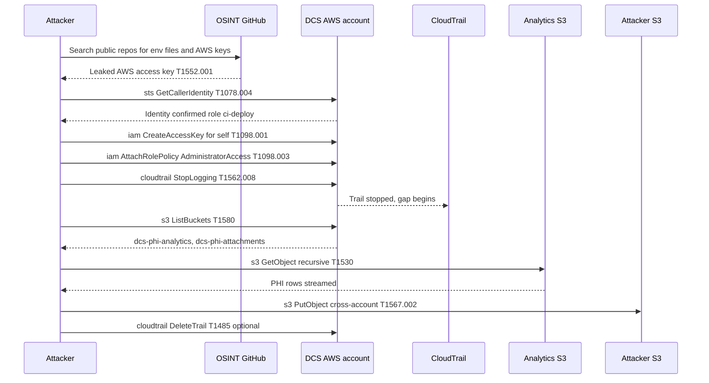

# Scenario 2 — MITRE ATT&CK sequence

## Narrative

An attacker discovers a developer's personal repo contains a `.env.backup` with an AWS access key (T1552.001). The key belongs to a CI service principal in DCS's prod account with `s3:*` on the analytics bucket. The attacker assumes the role, expands persistence, disables logging, then exfiltrates terabytes of analytics data to their own S3 bucket.

## Sequence

## Detection opportunities (in order)

1. **GitHub secret-scanning** — should fire on the original push of `.env.backup`. If push protection is on, the attack is stopped here.
2. **GuardDuty `UnauthorizedAccess:IAMUser/InstanceCredentialExfiltration`** — fires when an access key tied to an EC2 role is used from outside that EC2 (common pattern for stolen IMDS).
3. **CloudTrail `StopLogging` event** — should page security immediately; this is the high-confidence indicator of an in-progress incident.
4. **S3 server-access logs / CloudTrail data events** — bulk `GetObject` volume from one principal, in a short window, on a PHI bucket, is anomalous and should alert.
5. **VPC flow / NetFlow** — high outbound bytes from analytics workload toward non-DCS S3 endpoints.

If none of (1)–(5) fire, the attack succeeds undetected. That is the gap to close.

## MITRE technique table

| Step | Technique | ID |
|------|-----------|-----|
| Find leaked key | Credentials in Files | T1552.001 |
| Use cloud creds | Valid Accounts: Cloud | T1078.004 |
| Self-issue new key | Account Manipulation | T1098.001 |
| Grant admin policy | Cloud Roles | T1098.003 |
| Disable trail | Disable Cloud Logs | T1562.008 |
| List buckets | Cloud Infra Discovery | T1580 |
| Read PHI objects | Data from Cloud Storage | T1530 |
| Copy to attacker S3 | Exfil to Cloud Storage | T1567.002 |
| Delete trail | Data Destruction | T1485 |

## Hypotheses to test in the workshop

- (H1) GitHub secret-scanning is enabled with push protection on every DCS-owned org. → If false, R8 should be raised in severity.
- (H2) GuardDuty is enabled in every region and findings are routed to on-call. → If false, this scenario gets a near-100% success probability.
- (H3) `cloudtrail:StopLogging` is denied by an SCP at the org level. → If false, this is the single most cost-effective control to add.
