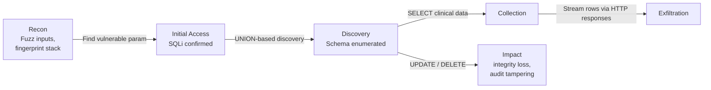

# Attack Scenario 3 — SQL injection against PHI database

## Threat summary

An attacker exploits an unsanitized input on a public-facing endpoint (search, filter, custom-report builder) to inject SQL and read or modify rows in the PHI database without holding any legitimate application credentials.

Why this scenario matters: SQLi is still in the OWASP Top 10 (A03:2021 — Injection). Healthcare apps often expose search and reporting endpoints with rich filters, which are common entry points.

## Kill-chain mapping

| Phase | Technique | Action |
|-------|-----------|--------|
| Recon | T1595.002 Active Scanning: Vulnerability Scanning | Crawl app, fingerprint stack, fuzz inputs |
| Initial Access | T1190 Exploit Public-Facing App | SQLi via vulnerable endpoint |
| Discovery | T1083 File and Directory Discovery / T1213 Data from Information Repositories | UNION-based extraction of schema, then data |
| Privilege Escalation | T1068 Exploitation for Privilege Escalation | DB role escalation if `SECURITY DEFINER` available |
| Collection | T1213 | `SELECT *` from `patients`, `clinical_notes`, etc. |
| Exfiltration | T1041 Exfiltration Over C2 Channel | Page-by-page UNION exfil over HTTPS response |
| Impact | T1565.001 Stored Data Manipulation | UPDATE rows (lab results), DELETE audit |

## Diagram

## Vulnerable patterns to look for in DCS

- String concatenation in custom report queries: `query = "SELECT ... WHERE patient_id = '" + id + "'"`.
- ORM raw escape hatches: `Model.objects.raw(...)`, Sequelize `query()`, Hibernate native query.
- Stored procedures using `EXECUTE` with concatenated input.
- Search endpoints accepting JSON filter DSLs that are flattened into WHERE clauses (e.g., MongoDB / PostgREST style without strict allowlist).

## Most likely controls today (assumed)

- Parameterized queries in the request path for the standard CRUD endpoints.
- WAF in front of the API with managed SQLi ruleset.
- DB user for app is non-superuser.

## Most likely gaps (validate)

- Custom report builder ("admin reports") bypasses WAF (internal-only URL but reachable post-auth) — input goes straight into a builder.
- DB user has `SELECT` on every PHI table, including columns the app doesn't need (over-privileged).
- No DB-level row-level security policies.
- WAF logs not reviewed; "blocked" events buried.
- No query-pattern anomaly detection on the database (Q1: huge new query fingerprint never seen before).

## Related artifacts

- MITRE walkthrough → `Sequence Summary.md`
- Detection / response playbook → `Runbook.md`

## Open questions

1. Does the API gateway enforce per-endpoint input schemas (allow only declared filters)?
2. Are DB grants written as the app's minimum-necessary, or `GRANT SELECT ON ALL`?
3. Is there row-level security based on subject claims?
4. Are SQLi WAF blocks routed to on-call?
