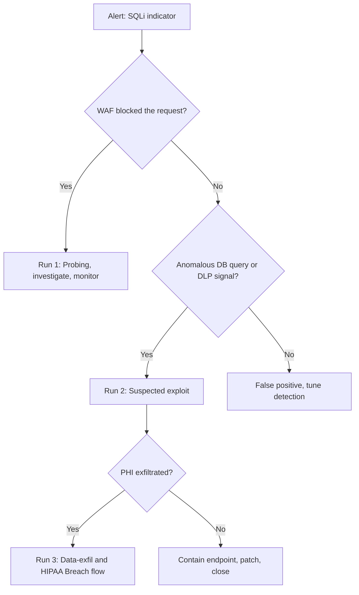

# Blue-Team Runbook — Scenario 3: SQL injection

## SLO targets

| Phase | Metric | Target |
|-------|--------|--------|
| Probe (WAF-blocked) | MTTD | < 15 min (alarm on burst of blocks from one source) |
| Successful exploit | MTTD | < 30 min (DB query anomaly + DLP egress signal) |
| Containment | MTTC | < 30 min (block source, disable endpoint, rotate DB cred) |
| Recovery | MTTR | < 24 h (patch input handling, redeploy) |

## Detection sources

| Source | Signal |
|--------|--------|
| WAF | Burst of SQLi rule matches from a single IP / ASN |
| API gateway | 4xx burst on `/patients/search`-type endpoints |
| Application audit log | Search query string with characters `' " ; -- /* */ UNION SELECT` after normalization |
| DB telemetry (`pg_stat_statements`, slow log) | New query fingerprint, very high `rows` value |
| DLP egress | Outbound response > 1 MB containing PII-pattern matches (SSN, MRN regex) |
| Anomaly: per-user PHI access | Single session pulls > N records (threshold tuned per role) |

## Triage decision tree

## Run #1 — Probing investigation

1. **Block the source**: WAF rule, IP allowlist on the edge, or geo-block if appropriate.
2. **Identify the target endpoint**: collect the exact paths and parameters being probed.
3. **Verify the WAF rule worked** for the variants observed: replay safely against a staging WAF.
4. **Open a hardening ticket**: tune ruleset for the observed evasion class (comments, encoding, case).
5. **Document** in `SEC-DCS` and close — no further action if no successful request.

## Run #2 — Suspected exploit

1. **Disable the vulnerable endpoint** via feature flag or path block at the API gateway; accept the temporary product impact.
2. **Rotate** DB credentials used by the application (immediately replace from secrets vault); audit the connections.
3. **Snapshot** DB at the current state for forensic comparison (no destructive change).
4. **Replay** the suspect request server-side to confirm reachability; in a sandbox if possible.
5. **Patch**: switch the endpoint to parameterized queries or strict filter DSL; add unit + integration tests; redeploy.
6. **Verify**: run a SQLi test suite (`sqlmap` against a non-prod copy with prod-like data) and confirm no exploitable path remains.
7. **Re-enable** the endpoint behind a tight WAF ruleset + extra logging.

## Run #3 — Data exfiltration response

Treat as confirmed PHI breach until risk-assessed otherwise.

1. **Quantify** rows exfiltrated using DB audit + application response logs.
2. **Identify affected patients**: produce the impacted-individuals list.
3. **Privacy Office** notification within 1 h.
4. **Follow** `Application Summary/Compliance Mapping.md` Breach Notification flow.
5. **Customer notice** drafted by Legal; CISO + Legal sign-off before dispatch.

## Hardening backlog

Items to file as tickets, linked to risks:

1. Semgrep rule that fails CI on string-concat into SQL (R3 / R6).
2. WAF ruleset tuning + quarterly bypass test (R6).
3. Per-endpoint JSON-schema validation enforced at gateway (R6).
4. `pg_stat_statements` shipped to observability + anomaly detection on new fingerprints (R4).
5. DB role review: least-privilege grants, row-level security on PHI tables (R6).
6. DLP egress inspection for PII patterns (R4 / R6).

## Evidence preservation

Same as Scenario 1, plus:

- [ ] Full WAF log for the source ASN, 30-day window
- [ ] API gateway access log for the endpoint, 30-day window
- [ ] DB query log (`pg_stat_statements` snapshot, slow log)
- [ ] Application audit log entries for the affected session(s)
- [ ] DB snapshot at the time of detection
