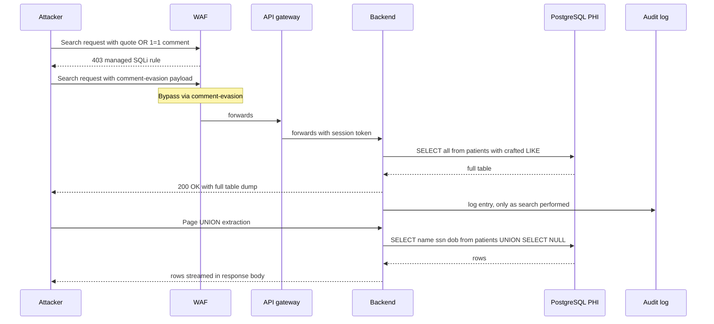

# Scenario 3 — MITRE ATT&CK sequence

## Narrative

The attacker probes the patient-search endpoint with classic payloads (`' OR 1=1--`, `' UNION SELECT NULL--`). The endpoint returns a database error revealing the engine (PostgreSQL 14) and a column count. The attacker chains a UNION-based extraction to enumerate `information_schema.tables`, then dumps the `patients` table page by page. WAF logs show "blocked" events, but they were not routed to the SOC.

## Sequence

## Detection opportunities (in order)

1. **WAF rules**: managed SQLi ruleset should block obvious payloads; tune for evasion (URL-encoded comments, case-mixing).
2. **WAF + API gateway alignment**: every WAF block at the edge should be auditable. Every 403 from WAF → metric → alarm at threshold.
3. **API input validation**: per-endpoint JSON schema with strict-allowlist filter DSL.
4. **DB query fingerprinting** (e.g., `pg_stat_statements` + diff vs baseline): an unseen plan or huge row count for a single query is a strong indicator.
5. **Application audit log granularity**: "search performed" is not enough — log the *normalized* query and the row count returned.
6. **DLP at egress**: outbound response inspection for patterns matching SSN / MRN at suspicious volume.

## MITRE technique table

| Step | Technique | ID |
|------|-----------|-----|
| Scan / fingerprint | Active Scanning: Vuln Scanning | T1595.002 |
| Inject via endpoint | Exploit Public-Facing App | T1190 |
| Enumerate schema | Data from Information Repositories | T1213 |
| Bulk read PHI | Data from Information Repositories | T1213 |
| Modify lab results | Stored Data Manipulation | T1565.001 |
| Delete audit rows (if DB role permits) | Indicator Removal | T1070 |

## Hypotheses to test in the workshop

- (H1) Every PHI-touching endpoint uses parameterized queries — verifiable by static analysis (Semgrep rule). If exceptions exist, list them and treat each as a finding.
- (H2) The WAF SQLi ruleset is in *Block* mode (not Count), and bypass evasions (comments, encoding, case) are tested quarterly.
- (H3) The DB role used by the app has `SELECT` only on the tables it actually queries.
- (H4) `pg_stat_statements` is exported to the observability platform and reviewed.
