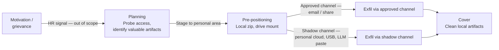

# Attack Scenario 4 — Insider threat: exfiltration of proprietary analytics / quant models

## Threat summary

A trusted insider — an analyst, ML engineer, or contractor with legitimate access — copies proprietary algorithms, model artifacts, or de-identified-but-valuable datasets outside DCS. Their goal may be to take work to a competitor, sell IP, or expose data. Because the access is authorized, traditional perimeter and identity controls do not block them.

Why this scenario matters: insiders bypass most preventive controls. Healthcare ML / quant models often represent years of R&D and may include training data that, even de-identified, is commercially sensitive and potentially re-identifiable.

## Kill-chain mapping (Insider Threat lifecycle)

Insider scenarios don't map cleanly to the external kill chain; the canonical model is CERT's *Insider Threat Lifecycle*:

| Phase | Behavior | MITRE / control reference |
|-------|----------|---------------------------|
| Motivation / grievance | Personal, financial, ideological trigger | HR signals — out of scope of tech model but feed UEBA |
| Planning | Survey access scope, identify what is valuable | T1083 / T1580 — increase in directory listing, role probing |
| Pre-positioning | Save data to personal storage, prepare exit | T1074 Data Staged |
| Exfiltration | Move data out via approved or shadow channels | T1052 Exfil over physical, T1567 Exfil to cloud, T1048 Exfil over alt protocol |
| Cover | Delete logs, clean local artifacts | T1070 Indicator Removal |

## Channels of exfiltration to consider

1. **Approved cloud share** (SharePoint, Google Drive, OneDrive) — looks normal, hard to detect.
2. **Personal email** — large attachments out, fwd of internal threads.
3. **USB / portable disk** — if not blocked by endpoint policy.
4. **Cloud-to-cloud** — copy from DCS S3 to personal AWS / GCS via developer's own creds.
5. **Source-code repositories** — push to a personal GitHub.
6. **Screenshots / phone camera** — slow but unstoppable for small models / formulas.
7. **AI chat tools** — pasting code or data into an LLM (no provenance, possibly retained by vendor).

## Diagram

## Most likely controls today (assumed)

- Approved-channel logging (email DLP).
- VPN required for production access; not for analyst data lake.
- Code commits in DCS-owned GitHub orgs only (in theory).

## Most likely gaps (validate)

- **No DLP on the analyst workstation**: zipping a 10 GB folder and emailing it is invisible.
- **No `gh` audit log review**: pushes to personal repos are easy via authenticated CLI.
- **No UEBA**: deviation from normal user behavior is not detected (e.g., analyst suddenly downloads 30× their average from S3).
- **Leaver flow weak**: at termination, access lingers for days; data already staged is not retroactively reviewed.
- **AI tool usage not governed**: paste into ChatGPT / Copilot has no provenance.

## Related artifacts

- MITRE walkthrough → `Sequence Summary.md`
- Detection / response playbook → `Runbook.md`

## Open questions

1. Do we run UEBA on data-lake access patterns?
2. Is the joiner-mover-leaver runbook automated? What is the median time-to-deprovision?
3. Are personal `gh auth login` events on managed workstations forbidden / detected?
4. Is there an acceptable-use policy for AI tools, and is it enforced via gateway?
