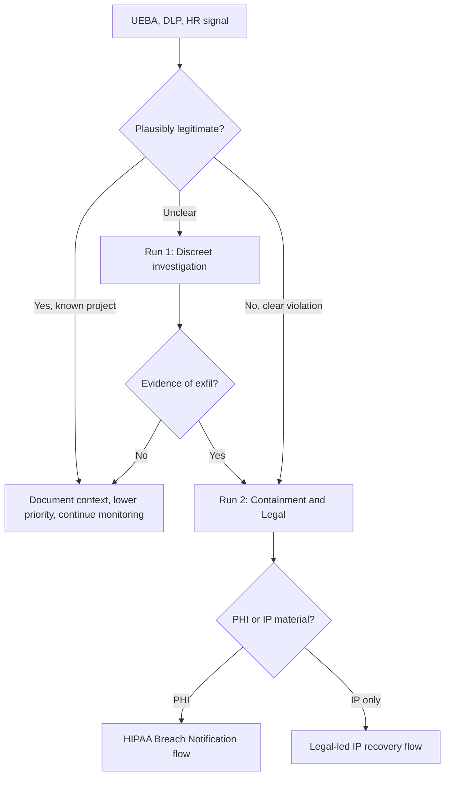

# Blue-Team Runbook — Scenario 4: Insider threat

## SLO targets

Insider scenarios are detection-heavy, not prevention-heavy. Targets are measured per-week, not per-minute.

| Phase | Metric | Target |
|-------|--------|--------|
| Planning / probing | MTTD anomalous access pattern | < 7 days |
| Pre-positioning | MTTD staging / zipping | < 24 h after first event |
| Exfiltration | MTTD exfil channel use | < 4 h |
| Containment (access revoke + legal hold) | MTTC | < 1 h after confirmation |

## Detection sources

| Source | Signal |
|--------|--------|
| UEBA on data lake | Per-user deviation in volume, diversity, time-of-day |
| Endpoint DLP | Large zip creation, USB mount, browser upload size |
| Cloud-storage proxy (CASB) | Uploads to non-corporate cloud accounts |
| Git audit (GitHub Enterprise Cloud) | `gh` push events to non-org repos from managed workstations |
| IdP | Sessions on personal services from managed device |
| HR integration | Notice of resignation, PIP, recent denial of internal transfer |
| Code review system | Sudden export of large branches, force-push to personal forks |

## Triage decision tree

## Run #1 — Discreet investigation

Insider cases are sensitive. Premature disclosure can compromise the investigation or expose the company to wrongful-conduct liability. Follow these rules strictly:

1. **Need-to-know only**: Incident commander, CISO, Legal, HR. Do not loop in the subject's manager unless explicitly authorized by Legal.
2. **Preserve, don't confront**: collect evidence, do NOT change access patterns observable to the subject.
3. **Legal hold**: open a legal hold on the subject's mailbox, drives, repos, and Slack — this preserves data and resets retention.
4. **Forensic image** of workstation done out-of-hours or remotely if possible.
5. **Scope** what was accessed in last 90 days; reconstruct downloads from data-lake logs.
6. **Decision point**: with Legal + HR, decide on confrontation, suspension, or surveillance continuation.

## Run #2 — Containment + Legal

Triggered when there is high-confidence evidence of misappropriation.

1. **Revoke access** at IdP — all sessions, all keys, all repos, all VPN.
2. **Recover devices**: managed laptop, phone, hardware tokens.
3. **Snapshot** everything before wiping anything (per Legal).
4. **Forensic interview** by HR + Legal (counsel present where required).
5. **Notice to receiving party** if known: cease-and-desist letter requesting return / destruction of materials.
6. **Disclosure**: only outward if material — customers (BAA breach notice), regulators (HIPAA Breach Notification if PHI), shareholders (if material per public-company rules).

## Run #3 — Joiner-mover-leaver tightening (continuous)

Outside the heat of an incident, ensure this is automated:

- **Joiner**: provisioning via IdP groups only; access reviewed by manager + security at 30 / 60 / 90 days.
- **Mover**: role change triggers re-baselining of access; old grants revoked unless explicitly re-justified.
- **Leaver**: notice-of-resignation triggers a "watch list" mode (increased UEBA scrutiny, no new access grants, mandatory exit interview with security checklist). On last day, all access revoked within 1 hour, devices recovered, exit-interview log archived.

## Hardening backlog

Items to file as tickets, linked to risks:

1. UEBA on data-lake access with per-role baselines and watch-list mode (R6).
2. Endpoint DLP on managed workstations: zip / USB / browser-upload policies (R6).
3. CASB / proxy enforcement: no uploads to non-corporate cloud accounts (R6).
4. GitHub Enterprise Cloud: enforce SAML SSO, block fork to personal accounts (R6).
5. Acceptable-Use Policy for AI tools enforced at gateway (R7).
6. Automated joiner-mover-leaver pipeline with HRIS integration (R2 / R6).
7. Annual insider-threat tabletop with HR + Legal + Security (R7).

## Evidence preservation

Per Legal direction. Typical scope:

- [ ] Workstation forensic image (memory + disk)
- [ ] Mailbox export and Slack DM export under legal hold
- [ ] IdP login history (90 days)
- [ ] Data-lake access logs (full retention)
- [ ] CASB / proxy logs (full retention)
- [ ] Git audit log (full retention)
- [ ] HR file references (timeline only, not contents)
- [ ] All chain-of-custody documentation

## Note on AI-tool exfiltration

Paste of source code or data into a consumer LLM is exfiltration even if the user thinks of it as "just asking for help". The model retention policy and vendor BAA status determine whether this constitutes a HIPAA Breach. Default policy: do not paste PHI or production source into any tool not on the approved-AI list. Approved tools must be on a BAA.
