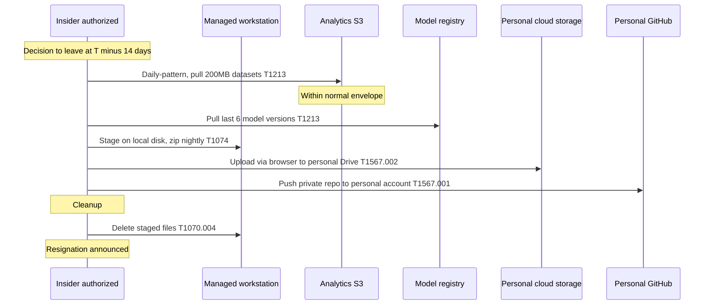

# Scenario 4 — Insider exfiltration sequence

## Narrative

An analyst with legitimate access to the analytics data lake decides to leave for a competitor. Over two weeks, they gradually download model artifacts and de-identified-but-valuable datasets to their workstation, zip them, and exfiltrate via personal cloud storage and personal GitHub. They are careful: never large in one shot, always under whatever DLP threshold they're aware of, and they delete local artifacts before resignation.

## Sequence

## Detection opportunities (in order)

1. **UEBA** on data-lake access — deviation in pull volume / time-of-day / object diversity per user. Even a 1.5× increase sustained for a week is a strong signal.
2. **DLP on managed endpoint** — detect zipping of large directories, file moves to `~/Downloads`, mount of unknown USB.
3. **Browser-uploads inspector / SSE-PAC** — large uploads to non-corporate domains over corporate network.
4. **`gh auth status` survey** — alert if personal `gh` is authenticated on a managed workstation.
5. **Joiner-mover-leaver telemetry** — when an employee gives notice, automatically increase scrutiny on their last 30/60/90 days of activity. Many tools support this "watch list" mode.
6. **HR signal integration (carefully, with privacy review)** — UEBA weights up when an employee is on a PIP, has a recent role denial, or has filed a resignation.

## MITRE technique table

| Step | Technique | ID |
|------|-----------|-----|
| Slow data collection | Data from Information Repositories | T1213 |
| Local staging / zip | Data Staged: Local Data Staging | T1074.001 |
| Exfil via personal cloud | Exfil to Cloud Storage | T1567.002 |
| Exfil via personal git | Exfil to Code Repository | T1567.001 |
| Clean local artifacts | File Deletion | T1070.004 |
| (If used) AI tool paste | Exfil over Web Service | T1567 |

## Hypotheses to test in the workshop

- (H1) UEBA is enabled on data-lake access with thresholds tuned per role; alerts go somewhere a human reads.
- (H2) Managed workstations block non-corporate cloud-storage uploads by default; exceptions are case-by-case.
- (H3) Personal `gh auth login` is detected and reported within 24 h.
- (H4) Acceptable-Use Policy for AI tools is enforced at gateway (no paste of source / data to consumer LLMs); a sanctioned enterprise option exists.
- (H5) Joiner-mover-leaver automation triggers watch-list mode on notice-of-resignation.
